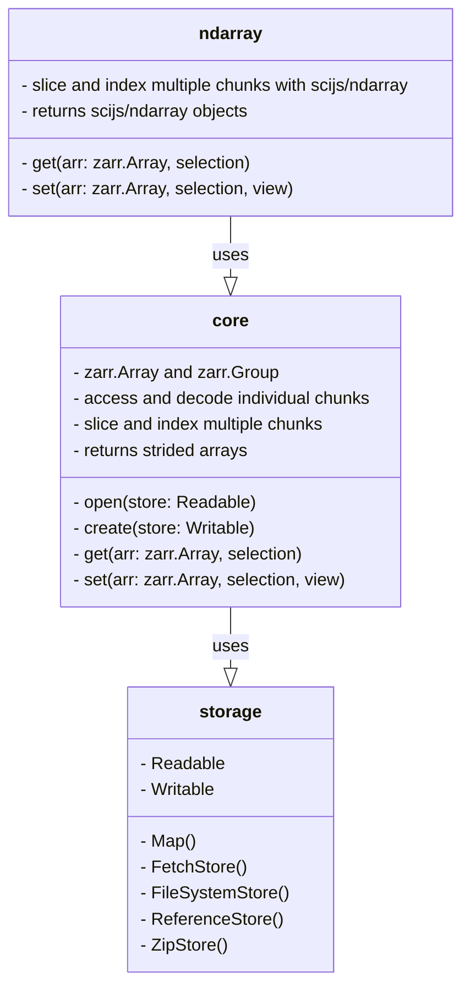

# zarrita.js <a href="https://manzt.github.io/zarrita.js"></img></a>

[](https://www.npmjs.com/package/zarrita)
[](https://github.com/manzt/zarrita.js/raw/main/LICENSE)


a minimal & modular Zarr implementation in TypeScript

- **Zero dependencies** (optionally
  [`scijs/ndarray`](https://github.com/scijs/ndarray))
- Runs natively in **Node**, **Browsers**, and **Deno** (ESM)
- Supports **v2** or **v3** protocols, C & F-order arrays, diverse data-types,
  and [ZEP2 Sharding](https://zarr.dev/zeps/draft/ZEP0002.html)
- Allows flexible **storage** backends and **compression** codecs
- Provides rich, in-editor **type information** via
  [template literal types](https://www.typescriptlang.org/docs/handbook/2/template-literal-types.html)

## Installation

**zarrita** supports a variety of environments, including the browser, Node.js,
and Deno.

If you're developing an application with Node.js, you can install **zarrita**
with yarn, npm, or pnpm:

```sh
npm install zarrita
```

Read
[the documentation](https://manzt.github.io/zarrita.js/get-started.html#getting-started)
to learn more about other environments.

## Usage

```javascript
import * as zarr from "zarrita";

const store = new zarr.FetchStore("http://localhost:8080/data.zarr");
const arr = await zarr.open(store, { kind: "array" }); // zarr.Array<DataType, FetchStore>

// read chunk
const chunk = await arr.getChunk([0, 0]);

// Option 1: Builtin getter, no dependencies
const full = await zarr.get(arr); // { data: Int32Array, shape: number[], stride: number[] }

// Option 2: scijs/ndarray getter, includes `ndarray` and `ndarray-ops` dependencies
import { get } from "@zarrita/ndarray";
const full = await get(arr); // ndarray.Ndarray<Int32Array>

// read region
const region = await get(arr, [null, zarr.slice(6)]);
```

Read [the documentation](https://manzt.github.io/zarrita.js) to learn more.

### Zarr building blocks

zarrita's API is almost entirely tree-shakeable, meaning developers are able to
pick and choose the features necessary for an application. This design choice
differs from existing implementations of Zarr in JavaScript, and allows zarrita
to be both minimal and more feature-complete if necessary.



## Development

This library uses the [`pnpm`](https://pnpm.io/) package manager and
[`uv`](https://github.com/astral-sh/uv) for creating fixtures with Python.
Please make sure you have both installed before running the following commands:

```bash
pnpm install
pnpm build
pnpm test
```

The tests are run with [Vitest](https://github.com/vitest-dev/vitest), which is
a Node.js test runner. To try our a development version of **zarrita** in the
browser, run `pnpm build` and start a web-server in the root of the repository:

```sh
python3 -m http.server .
# navigate to localhost:8000/demo.html
```

You can edit the contents of `demo.html` and refresh the page.


### Generating fixtures
Fixtures are generated with Python scripts located in the `scripts/` directory.
To regenerate all fixtures, run:
```sh
pnpm run update-fixtures
```
