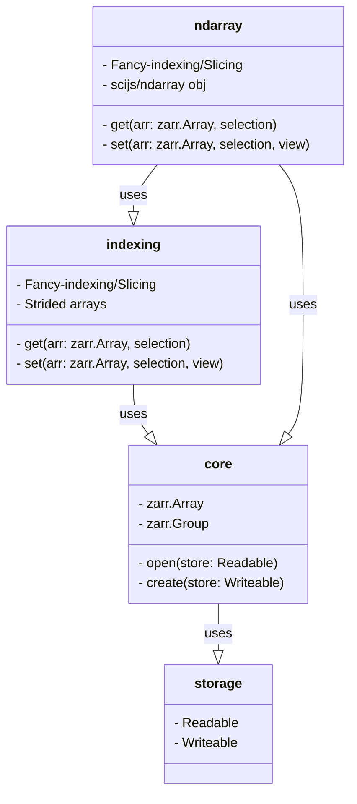

**Here be dragons** 🐉

# zarrita.js

**zarrita** is a minimal & modular Zarr implementation in TypeScript.

- **Zero dependencies** (optionally
  [`scijs/ndarray`](https://github.com/scijs/ndarray))
- Runs natively in **Node**, **Browsers**, and **Deno** (ESM)
- Supports **v2** or **v3** protocols, C & F-order arrays, and diverse
  data-types
- Allows flexible **storage** backends and **compression** codecs
- Provides rich, in-editor **type information** via
  [template literal types](https://www.typescriptlang.org/docs/handbook/2/template-literal-types.html)

## Usage

```javascript
import * as zarr from "@zarrita/core";
import { FetchStore } from "@zarrita/storage";

const store = new FetchStore("http://localhost:8080/data.zarr");
const arr = await zarr.open.v2(store, { kind: "array" }); // zarr.Array<DataType, FetchStore>

// read chunk
const chunk = await arr.get_chunk([0, 0]);

// Option 1: Builtin getter, no dependencies
import { get, slice } from "@zarrita/indexing";
const full = await get(arr); // { data: Int32Array, shape: number[], stride: number[] }

// Option 2: scijs/ndarray getter, includes `ndarray` and `ndarray-ops` dependencies
import { get } from "@zarrita/ndarray";
const full = await get(arr); // ndarray.Ndarray<Int32Array>

// read region
const region = await get(arr, [null, zarr.slice(6)]);
```

### Zarr building blocks

zarrita's API is almost entirely tree-shakeable, meaning users are able to pick
and choose only the features of Zarr which are necessary for an applications. At
its core, the `zarr.Array` class allows accessing and decoding individual array chunks.
"Fancy-indexing" and "slicing" are accomplished via (optional) functions which
operate on `zarr.Array` objects.

Thus, you only pay for these features if used (when bundling for the web). This
design choice differs from existing implemenations of Zarr in JavaScript, and
allows zarrita to be both minimal and more feature-complete if necessary.



### In Browser (or Deno)

```javascript
import * as zarr from "https://esm.sh/@zarrita/core";
import { get } from "https://esm.sh/@zarrita/indexing";
```

### In Node.js or Application Bundles

Import using ES module syntax as a namespace:

```javascript
import * as zarr from "@zarrita/core";
```

or with targeted named imports:

```javascript
import { open } from "@zarrita/core";
```

## Development

This library uses the [`pnpm`](https://pnpm.io/) package manager.

```bash
pnpm install
pnpm build
pnpm test
```
